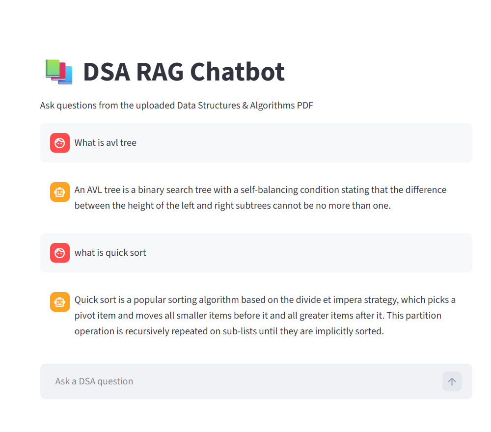

# 📚 DSA RAG Chatbot

An **AI-powered Retrieval-Augmented Generation (RAG) chatbot** that answers questions from a **Data Structures and Algorithms (DSA) PDF document**.

This project uses **LangChain, Google Gemini embeddings, Pinecone vector database, and Streamlit** to retrieve relevant content from the document and generate accurate answers.

---

## 🚀 Features

- Ask questions directly from a **PDF document**
- Uses **vector embeddings** for semantic search
- Stores document embeddings in **Pinecone Vector Database**
- Generates answers using **LLM based on retrieved context**
- Interactive **Streamlit chatbot interface**
- Provides answers strictly based on document content

---

## 🧠 How It Works

The system follows a **Retrieval-Augmented Generation (RAG) pipeline**:

1. Load the **PDF document**
2. Split the text into **smaller chunks**
3. Generate **embeddings using Gemini**
4. Store embeddings in **Pinecone Vector Database**
5. Convert the **user question into an embedding**
6. Perform **vector similarity search**
7. Retrieve the **most relevant document chunks**
8. Send the context to the **LLM**
9. Generate the **final answer**
---

## 🛠 Tech Stack

| Technology | Purpose |
|------------|--------|
| Python | Core programming language |
| LangChain | RAG framework |
| Google Gemini Embeddings | Text vectorization |
| Pinecone | Vector database |
| Streamlit | Chat UI |
| PyPDF | PDF document loader |
| python-dotenv | Environment variable management |

---

```
RAG-System/
│
├── data/
│ └── dsa.pdf
│
├── index.py # Indexing pipeline (PDF → embeddings → Pinecone)
├── query.py # Terminal-based chatbot
├── app.py # Streamlit chatbot interface
│
├── requirements.txt
├── README.md
├── .gitignore
└── .env.example
```

---

## 🔑 Environment Variables

Create a `.env` file in the project root directory:

- GEMINI_API_KEY=your_api_key
- PINECONE_API_KEY=your_api_key
- PINECONE_INDEX_NAME=your_index_name


---

## 💬 Example Questions

You can ask questions like:

- What is quick sort?
- What is the time complexity of binary search?
- Explain linked lists.
- What is an AVL tree?

---

## 📸 Demo


---

## 📈 Future Improvements

- Multi-document support  
- Hybrid search (vector + keyword search)  
- Agentic RAG architecture  
- Cloud deployment  
- Chat memory  

---

## 📜 License

This project is intended for **educational and research purposes**.

---

## 👨‍💻 Author

**Sumit Sharma**  
B.Tech CSE Student | AI & Machine Learning Enthusiast
